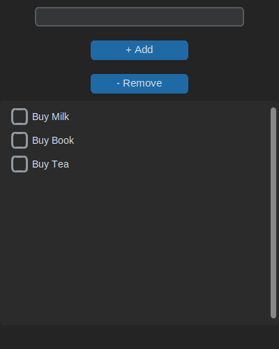

# ToDo List

**ToDo List** is a simple educational project built with **Python**.  
Its main purpose is to **manage your todos** with a clean graphical user interface (GUI) using `tkinter`.  
This project demonstrates basic CRUD operations for managing students and shows how to integrate traditional Python logic with a GUI.

---

## 📌 Project Description

- **Name:** ToDo List
- **Type:** Python GUI Application
- **Purpose:** Add, remove, display todos easily through an intuitive GUI.
- **GUI Integration:** Implemented with `customtkinter` and smart data persistence

---

## Screenshot



---

## ⚙️ Available Functions

| Function   | Description                 |
| ---------- | --------------------------- |
| `add()`    | Add a new todo to the list  |
| `remove()` | Remove a todo from the list |

---

## 💾 Data Persistence

**How does it store the data?**

- This project uses **Smart Data Serialization** (`json`) to store the list of students **in a json file**.
- The data **will persist as long as the data.json file is found**.

---

## ✅ Requirements

To run this project, you need:

- **Python 3.7+**
- Standard Python library only:
  - `customtkinter`
  - `json` (built-in)

---

## 🖥️ Supported Operating Systems

This project runs on:

- ✅ **Windows** (tested)
- ✅ **Linux** (tested)
- ✅ **macOS** (should work as long as `customtkinter` is installed)

---

## 🚀 How to Run

```bash
# 1️⃣ Make sure you have Python installed:
python3 --version

# 2️⃣ Install customtkinter:
python3 -m venv .venv
source .venv/bin/activate
pip install customtkinter

# 3️⃣️ Run The Python File:
python3 app.py
```

---

## Discalmer
This app doesn't save the status whether it's checked or not, to check the data edit the data.json file and edit the "done" value to true instead of false, I am working on saving status function

---

## Contributing

We Welcome all contributions of all kinds- whether it's fixing bugs, improving the code, or suggesting new features.
if you'd like to contribute:

1. Fork the repository
2. Create a new branch for your feature or fix
3. Commit your changes with clear messages
4. Open a pull request describing your changes

Please make sure your code is clean, well-documented, and passes all tests if applicable

---

## Issues

if you find an issue in the application please report in [Issues](https://github.com/codey260/todo-list/issues)
